(P:licence)=
# Licence

<!-- Add licence for:
chat convolution
pièce convolution
3 gaussiennes fourier
registration
freiburg
fingerprint
mickey
MM
dobble
R8
moulinsart
moravec
hough
coins lab 4
simpsons1
simpsons2
-->

Vincent Mazet,
« <b>Basics of image processing</b> »,
Université de Strasbourg, 2020-2027.

</a>This work is licensed under a
<a rel="license" href="https://creativecommons.org/licenses/by-nc/4.0/">Creative Commons Attribution-NonCommercial 4.0 International License</a>.
&nbsp;
&nbsp;
&nbsp;.

This bokk is written with <a href="https://jupyterbook.org">Jupyter Book</a> and <a href="https://mystmd.org/made-with-myst">MyST</a>:

E-mail: <a href="mailto:vincent.mazet@unistra.fr">vincent.mazet@unistra.fr</a>.

## Image credits

::::{grid} 1 2 2 3

:::{card} 
Quark67 (Modified color by Monami), CC BY-SA 3.0
[Original picture](https://upload.wikimedia.org/wikipedia/commons/0/05/AdditiveColorMixing.svg).
:::

:::{card} 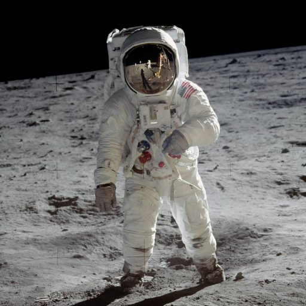
&copy; [NASA](https://www.nasa.gov/multimedia/guidelines/index.html), 2018.
NASA content generally are not copyrighted.
[Original picture](https://www.nasa.gov/mission_pages/apollo/40th/images/apollo_image_12.html).
:::

:::{card} 
&copy; Céline Meillier.
Public domain.
:::

:::{card} 
&copy; Céline Meillier.
Public domain.
:::

:::{card} 
He, Sun, Tang, "Single image haze removal using dark channel prior", CVPR 2009
[doi:10.1109/CVPR.2009.5206515](https://doi.org/10.1109/CVPR.2009.5206515).
:::

:::{card} 
&copy; Daniel Seehausen.
Free license.
[Original picture](https://pixabay.com/illustrations/greece-map-black-only-greece-1613310/).
:::

:::{card} 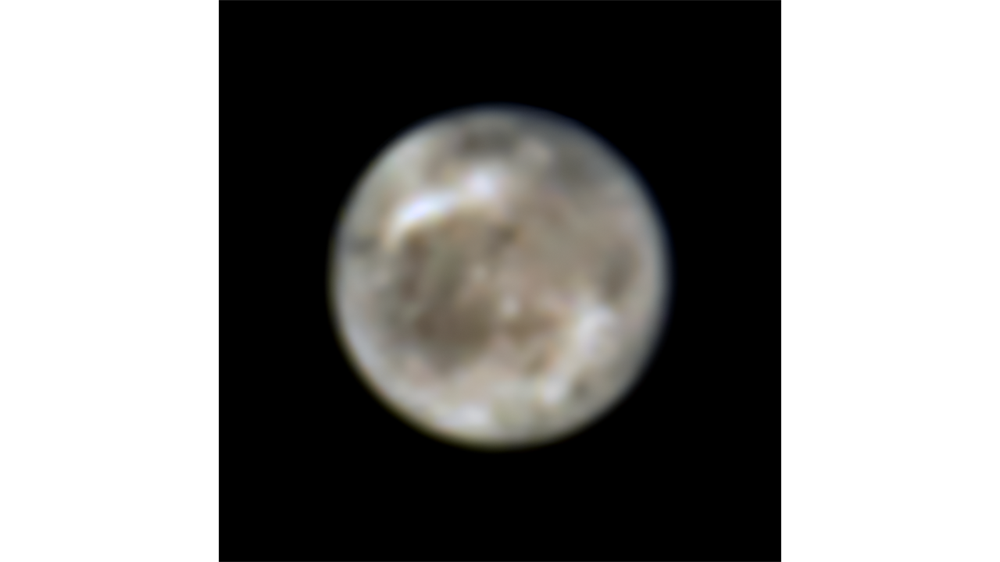
&copy; [NASA](https://www.nasa.gov/multimedia/guidelines/index.html), 2021.
NASA content generally are not copyrighted.
[Original picture](https://hubblesite.org/contents/media/images/2021/033/01FAK2DXF2Q733DN8JYEFZQZTF?Topic=101-solar-system).
:::

:::{card} 
Bacon _et al._, "The MUSE 3D view of the Hubble Deep Field South", A&A, 575 (2015)
[Original picture](http://muse-vlt.eu/science/hdfs-v1-0/).
:::

:::{card} 
&copy; [Irene Kredenets](https://unsplash.com/@ikredenets?utm_source=unsplash&utm_medium=referral&utm_content=creditCopyText)
on [Unsplash](https://unsplash.com/s/photos/pepper?utm_source=unsplash&utm_medium=referral&utm_content=creditCopyText).
Free license.
[Original picture](https://unsplash.com/photos/0PUoXmsCSDQ/).
:::

:::{card} 
Knutux (assumed), public domain,
[Original picture](https://commons.wikimedia.org/wiki/File:Photo-diode.svg)
:::

:::{card} 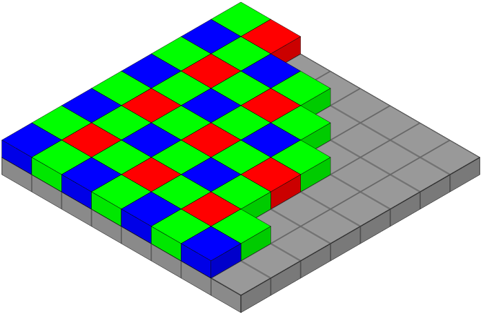
en:User:Cburnett - Own work, CC BY-SA 3.0,
[Original picture](https://commons.wikimedia.org/w/index.php?curid=1496858)
:::

:::{card} 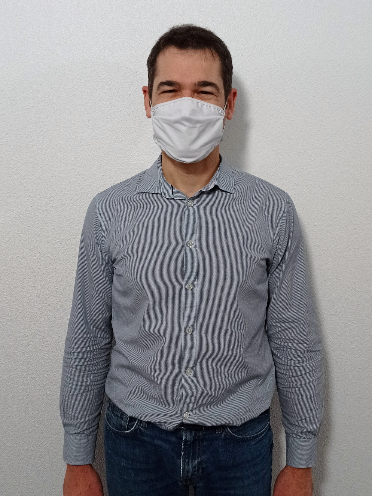
&copy; Vincent Mazet, 2021.
Public domain.
:::

:::{card} 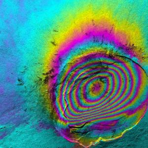
&copy; NASA/JPL/CIT.
[Original picture](https://nisar.jpl.nasa.gov/mission/get-to-know-sar/interferometry/)
:::

:::{card} 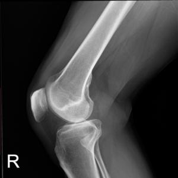
Ptrump16, CC BY-SA 4.0.
[Original picture](https://commons.wikimedia.org/wiki/File:Knee_plain_X-ray.jpg)
:::

:::{card} 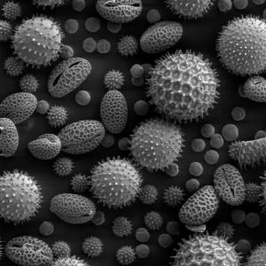
Dartmouth College Electron Microscope Facility, public domain.
[Original picture](https://en.wikipedia.org/wiki/File:Misc_pollen.jpg)
:::

:::{card} 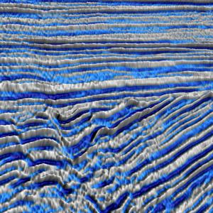
Geophysicus, CC BY-SA 4.0.
[Original picture](https://commons.wikimedia.org/wiki/File:Seismic_from_an_unconformity.jpg)
:::

:::{card} 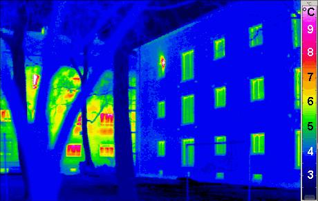
Passivhaus Institut, CC BY-SA 3.0.
[Original picture](https://commons.wikimedia.org/wiki/File:Passivhaus_thermogram_gedaemmt_ungedaemmt.png)
:::

:::{card} 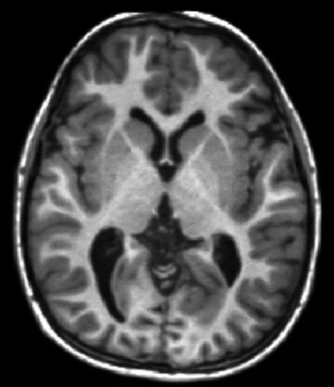
Johns Hopkins University, Public domain.
[Original picture](https://commons.wikimedia.org/wiki/File:T1-weighted-MRI.png)
:::

:::{card} 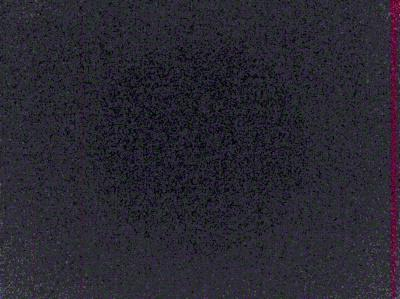
Vincent Mazet, Public domain.
:::

:::{card} 
Vincent Mazet, Public domain.
:::

:::{card} 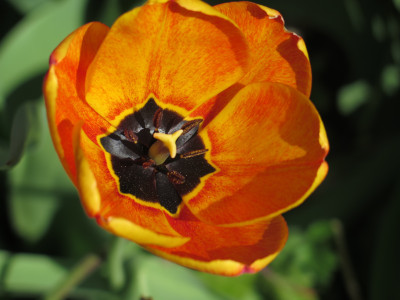
Vincent Mazet, Public domain.
:::

:::{card} 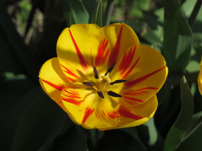
Vincent Mazet, Public domain.
:::

:::{card} 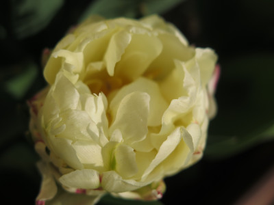
Vincent Mazet, Public domain.
:::

:::{card} 
&copy; Vincent Mazet, 2016.
Public domain.
:::

:::{card} 
&copy; Vincent Mazet, 2008.
Public domain.
:::

:::{card} 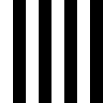
&copy; Vincent Mazet, 2016.
Public domain.
:::

:::{card} 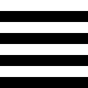
&copy; Vincent Mazet, 2016.
Public domain.
:::

:::{card} 
&copy; Vincent Mazet, 2016.
Public domain.
:::

:::{card} 
&copy; Vincent Mazet, 2016.
Public domain.
:::

:::{card} 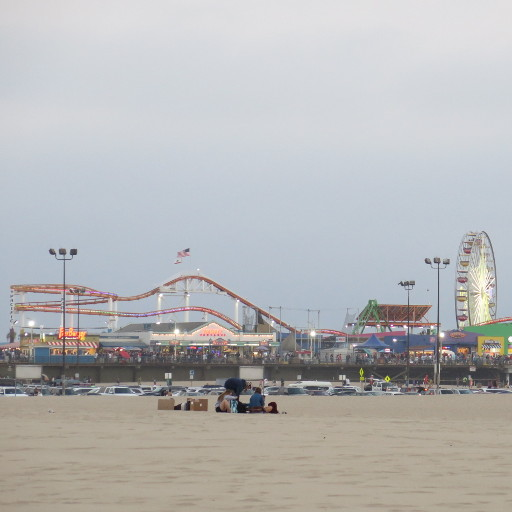
&copy; Vincent Mazet, 2016.
Public domain.
:::

:::{card} 
&copy; Vincent Mazet, 2016.
Public domain.
:::

:::{card} 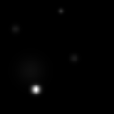
&copy; Vincent Mazet.
Public domain.
:::

:::{card} 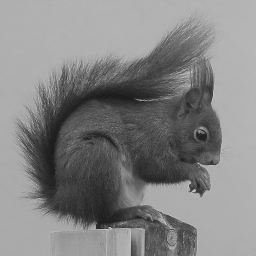
&copy; Vincent Mazet, 2020.
Public domain.
:::

:::{card} 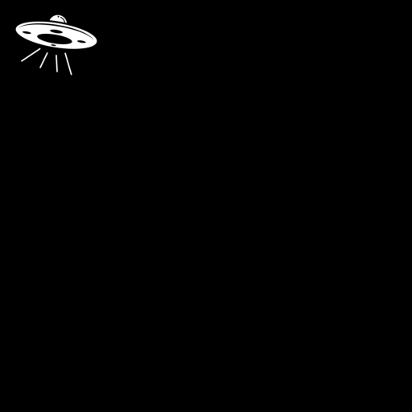
&copy; Mete Eraydın.
Creative Commons CC-BY.
[Original picture](https://thenounproject.com/term/ufo/100819/).
:::

:::{card} 
M.-L. Huang, T.-Y. Ling, "Dataset of Breast mammography images with Masses", Mendeley Data, V1 (2020)
[doi:10.17632/x7bvzv6cvr.1](https://data.mendeley.com/datasets/x7bvzv6cvr/1).
:::

:::{card} 
&copy; [ICube/Sertit](https://sertit.unistra.fr/).
:::

:::{card} 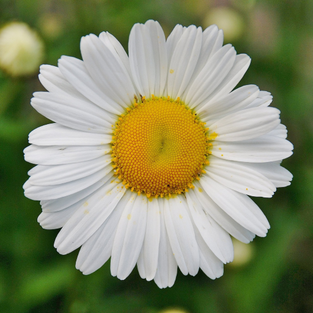
&copy; GLady.
Free license.
[Original picture](https://pixabay.com/photos/floral-daisy-blossom-plant-natural-50157/).
:::

:::{card} 
Lunar Orbiter 1 image of Taruntius crater on the Moon.
&copy; NASA.
[Original picture](https://nssdc.gsfc.nasa.gov/imgcat/html/object_page/lo1_m31.html).
:::

:::{card} 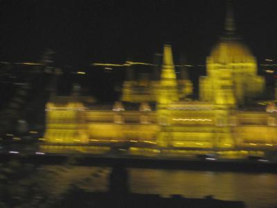
&copy; Céline Meillier.
Used with permission.
:::

:::{card} 
Rosetta last image
&copy; ESA/Rosetta/MPS for OSIRIS Team MPS/UPD/LAM/IAA/SSO/INTA/UPM/DASP/IDA.
[Original picture](https://www.esa.int/ESA_Multimedia/Images/2016/09/Rosetta_s_last_image).

:::

:::{card} 
Sailboat on lake, from The USC-SIPI Image Database.
unknown copyright status.
[Original picture](https://sipi.usc.edu/database/database.php?volume=misc&image=12)
:::

:::{card} 
Optical Fiber Sensor.
&copy; Sylvain Lecler (ICube/IPP).
Used with permission.
:::

:::{card} 
travail dérivé: FischX / Station Clock.jpg: JuergenG, AlMare.
[CC BY-SA 2.5](https://creativecommons.org/licenses/by-sa/2.5),
via Wikimedia Commons.
:::

:::{card} 
Mandrill (a.k.a. Baboon), from The USC-SIPI Image Database.
[Original image](https://sipi.usc.edu/database/database.php?volume=misc&image=10#top)
Scan from a magazine picture. Copyright belongs to original publisher or photographer.
:::

:::{card} 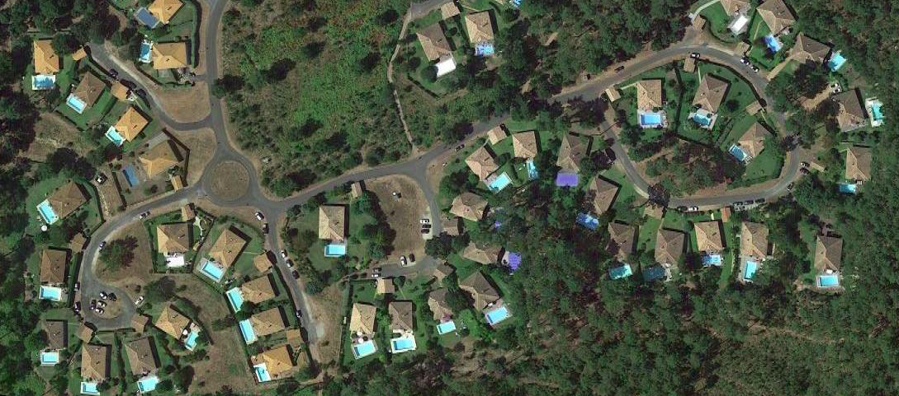
Aerial view of Moliets-et-Maa, from [Google Earth](https://goo.gl/maps/5Q269sYwyCTmDUY38).
&copy; Maxar Technologies, 207.
:::

:::{card} 
Resolution chart, from The USC-SIPI Image Database.
[Original image](https://sipi.usc.edu/database/database.php?volume=misc&image=18#top).
Source and copyright status are unknown.
:::

:::{card} 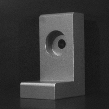
Industrial part.
&copy; Ernest Hirsch (ICube/MIV).
Used with permission.
:::

:::{card} 
Holly Fischer.
[CC BY 3.0](https://creativecommons.org/licenses/by/3.0),
via Wikimedia Commons.
:::

:::{card} 
BenRG.
Public domain,
via Wikimedia Commons.
:::

:::{card} 
GilPe.
Public domain,
via Wikimedia Commons.
:::

:::{card} 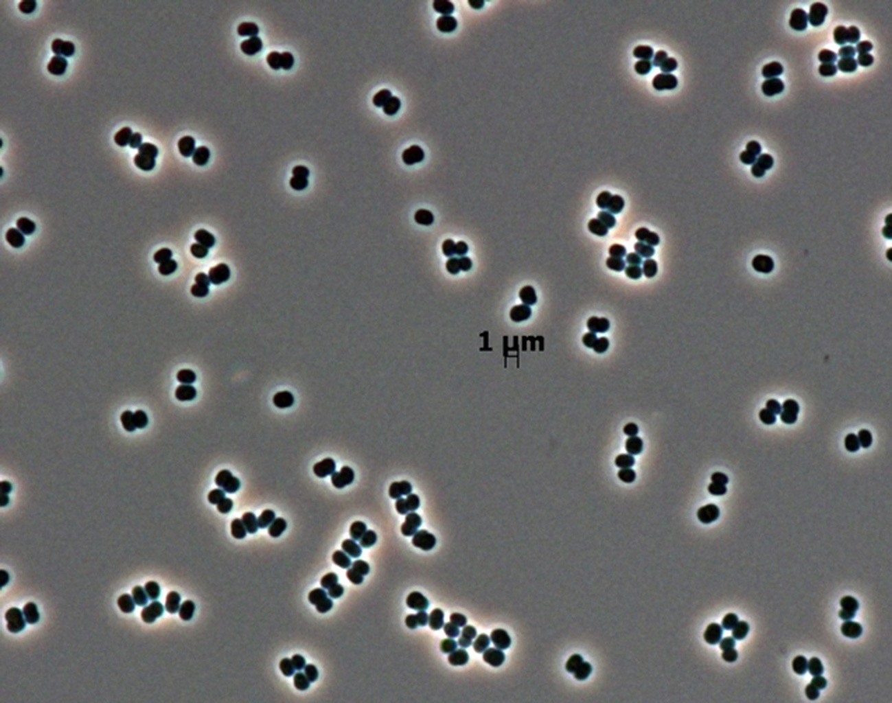
&copy; [NASA/JPL-Caltech](https://www.nasa.gov/multimedia/guidelines/index.html), 2018.
NASA content generally are not copyrighted.
[Original picture](https://www.jpl.nasa.gov/spaceimages/details.php?id=PIA17369).
:::

:::{card} 
&copy; Vincent Mazet, 2025.
Public domain.
:::

::::

Other images from [scikit-image](https://scikit-image.org/docs/dev/api/skimage.data.html).